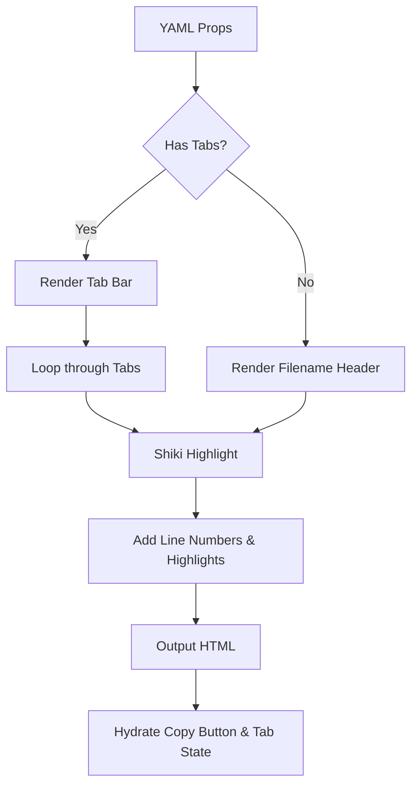

Sounds good.  Now lets discuss the CodeWindow widget.  Describe in detail how that would work and its features.

---------------------------------------------

The `CodeWindow` widget transforms static code snippets into interactive, context-rich developer tools. In standard Markdown, code blocks are rigid. In `@astrical/docs`, the `CodeWindow` is a flexible container that solves the three biggest headaches of technical docs: **Context** (Filename), **Choice** (Tabs/Languages), and **Focus** (Line Highlighting).

Here is the detailed breakdown of the `CodeWindow` widget.

### 1. The Core Philosophy: "The Editor Experience"

We aren't just displaying text; we are simulating a slice of an IDE (Integrated Development Environment).

* **Context First:** Code is rarely isolated. It belongs to a file (`server.ts`) or a process (`Terminal`). The widget must visually communicate this.
* **Choice Architecture:** Users often need to choose their path (npm vs. yarn, Python vs. Node). Tabs are first-class citizens, not a plugin hack.
* **Source Truth:** Like the `Prose` widget, code should ideally be able to pull from a real file to ensure the docs never go out of sync with the codebase.

### 2. Key Features

1. **Multi-Tab Support:** Natively supports switching between languages or package managers without page reloads.
2. **Smart Copy:** A copy button that strips out shell prompts (`$` or `>`) before copying, so users don't paste invalid commands.
3. **Line Highlighting:** The ability to dim irrelevant code and spotlight specific lines (e.g., "Look at lines 4-6").
4. **"Diff" Mode:** Built-in support for diff syntax (`+` and `-` lines) to show code changes, colored red/green automatically.
5. **Footer Annotations:** Optional footer to link to the full source file on GitHub.

### 3. The Schema (YAML)

The schema supports two modes: **Single File** (simple) and **Multi-Tab** (complex).

#### Mode A: Single File (Simple)

```yaml
- type: CodeWindow
  title: "astro.config.mjs" # Filename acts as title
  language: javascript
  highlight: "4-6"          # Highlight lines 4, 5, and 6
  code: |
    import { defineConfig } from 'astro/config';
    import tailwind from '@astrojs/tailwind';
    
    export default defineConfig({
      integrations: [tailwind()],
    });

```

#### Mode B: Tabbed Group (Complex)

```yaml
- type: CodeWindow
  tabs:
    - title: "npm"
      language: bash
      code: "npm install @astrical/core"
    - title: "pnpm"
      language: bash
      code: "pnpm add @astrical/core"
    - title: "yarn"
      language: bash
      code: "yarn add @astrical/core"

```

#### Mode C: Source Fetching (The "Pro" Move)

Instead of hardcoding the string, point to a real file in your repo.

```yaml
- type: CodeWindow
  title: "src/utils/auth.ts"
  language: typescript
  src: "examples/auth-demo.ts" # Reads from content/examples/
  region: "login-function"     # Optional: Only extract lines between special comment markers

```

### 4. Implementation Logic (`CodeWindow.astro`)

Since you are using Astro, you have access to **Shiki** (a high-fidelity syntax highlighter) natively. You should use this instead of client-side PrismJS to avoid layout shift and heavy JS payloads.

**The "Tab" Logic:**

* If `tabs` is present, render a header row with buttons.
* Use standard CSS/JS to toggle visibility of the code blocks.
* **Crucial Detail:** Sync tab selection across the page. If a user clicks "pnpm" on the installation widget, *all* subsequent widgets on the page should switch to "pnpm" automatically (using a shared `localStorage` key or NanoStore).

**The "Terminal" Look:**
If `language: bash` or `language: shell` is detected, the widget style should shift:

* Remove line numbers (usually irrelevant for terminals).
* Darker background.
* Change the window dots (Red/Yellow/Green) to a simple "Terminal" icon.

### 5. Architectural Diagram

Here is how the component constructs itself based on the props:



### 6. Why this beats Markdown

In standard Markdown, doing a "Tabbed" code block usually involves ugly syntax hacks like:

```markdown
#### **npm**
```bash
npm install

```

#### **yarn**

```bash
yarn add

```

```

This is fragile text parsing. In your YAML strategy, it is a structured array. This means your AI agent will **never** accidentally break the tab syntax or mismatch the closing tags. It just generates a list of objects.

### 7. Strategic Add-on: The "Play" Button
For a future version of this widget (v1.2), since you have the structure, you could add a `playground: true` prop.
If detected, the widget could inject a "Run on StackBlitz" or "Open in CodeSandbox" button that automatically creates a sandbox with that specific code snippet pre-loaded. This is trivial to generate because you already have the code as a distinct data field.

```

---------------------------------------------

We use Nanostores in the Astrical core for form caching so that is available.  How would the code window know how to group all related code selectors though?  Also what would be the best strategy for bundling code with the docs where we could reference files?  This seems like it could be problematic for private codebases or large files.  Im not against including that feature though.

---------------------------------------------

This is a great operational question. Since Astrical is already using Nanostores, we can leverage that for a robust, "state-aware" documentation experience without heavy framework overhead.

Here is the strategy for handling **Global Tab Syncing** and **Safe Source Code Bundling**.

### 1. Solving Context: The "Tab Group" Strategy

You asked: *"How would the code window know how to group all related code selectors?"*

The best approach is a **"Label-Based Sync"** combined with an explicit **`tabGroup`** property.

#### The Nanostore Architecture

Instead of wiring widgets together manually, we create a single persistent store called `docsPreferences`.

**`src/stores/docs.ts`**

```typescript
import { persistentMap } from '@nanostores/persistent';

// Keys = Group Name (e.g., 'pkg-manager', 'language')
// Values = Selected Tab Label (e.g., 'npm', 'typescript')
export const tabPreferences = persistentMap<Record<string, string>>('astrical:docs-tabs', {});

```

#### The Logic

When you define the widget in YAML, you can optionally assign it a `tabGroup`.

**YAML Input:**

```yaml
- type: CodeWindow
  tabGroup: pkg-manager # <--- The Sync Key
  tabs:
    - title: npm
      code: npm install
    - title: yarn
      code: yarn add

```

**Component Behavior (`CodeWindow.astro` + Client Script):**

1. **Read:** When the component mounts, it checks `tabPreferences.get('pkg-manager')`.
2. **Match:** If the store says `'yarn'`, and this widget has a 'yarn' tab, it automatically switches to it.
3. **Write:** If the user clicks 'pnpm', it updates the store: `tabPreferences.setKey('pkg-manager', 'pnpm')`.
4. **Reaction:** All other widgets listening to `pkg-manager` instantly switch to 'pnpm'.

---

### 2. Solving Bundling: The "Sandbox" Strategy

You asked about the safety and size risks of referencing files (`src: "examples/auth.ts"`).

**The Risk:** If you allow `fs.readFile` on any path, a user (or AI) could accidentally write `src: "../../.env"`, leaking secrets into your public documentation build.

**The Solution:** The **"Content Sandbox"** pattern.

#### A. The Sandbox Rule

Do not allow the module to read from your application `src/` folder directly. Instead, enforce a dedicated directory for documentation code snippets, such as `content/snippets/` or `examples/`.

* **Allowed:** `src: "auth/login.ts"` (Resolves to `content/snippets/auth/login.ts`)
* **Blocked:** `src: "../src/main.ts"` (Throws a build error)

#### B. The "Region" Pattern (For Large Files)

To solve your concern about "Large Files," we implement **Region Extraction**. This allows you to reference a massive file but only display 10 lines of it.

**In your real code file (`content/snippets/server.ts`):**

```typescript
import { App } from 'astrical';

// @snippet:start server-init
const app = new App();
app.listen(3000);
// @snippet:end server-init

// ... 500 lines of other code ...

```

**In your YAML Widget:**

```yaml
- type: CodeWindow
  title: "Server Initialization"
  src: "server.ts"
  region: "server-init" # Only grabs lines between the start/end markers

```

#### C. Implementation (Build-Time Loader)

Since Astro builds statically, this file reading happens in the **Node.js context** during the build. It does *not* bundle the whole file into the client JS. It only bakes the extracted text into the HTML.

**`modules/docs/src/utils/codeLoader.ts`**

```typescript
import fs from 'node:fs/promises';
import path from 'node:path';

const SNIPPET_DIR = path.resolve('content/snippets');

export async function loadSnippet(filePath: string, region?: string): Promise<string> {
  // 1. Sanitize Path (Prevent Directory Traversal)
  const safePath = path.normalize(filePath).replace(/^(\.\.(\/|\\|$))+/, '');
  const fullPath = path.join(SNIPPET_DIR, safePath);

  // 2. Read File
  let content = '';
  try {
    content = await fs.readFile(fullPath, 'utf-8');
  } catch (e) {
    return `Error: Snippet not found at ${safePath}`;
  }

  // 3. Extract Region (if requested)
  if (region) {
    const startMarker = `// @snippet:start ${region}`;
    const endMarker = `// @snippet:end ${region}`;
    
    const lines = content.split('\n');
    const start = lines.findIndex(l => l.includes(startMarker));
    const end = lines.findIndex(l => l.includes(endMarker));

    if (start !== -1 && end !== -1) {
      // Return only the lines between markers, stripping the markers themselves
      return lines.slice(start + 1, end).join('\n').trim(); 
    }
  }

  return content;
}

```

### Summary of Benefits

1. **Security:** The `codeLoader` ensures strictly read-only access limited to the `content/snippets` folder. Your private `src/` logic remains untouched.
2. **Performance:** Since the "Region Extraction" happens at **Build Time**, the user only downloads the 5 lines of code they need to see, not the 5MB file.
3. **DX:** You can write your example code in real TypeScript files (getting full linting/type-checking) and just reference it in the docs. The docs never go out of date or have syntax errors.

**Next Step:**
We have defined the **Sections** (`DocsLayout`), the **Widgets** (`Prose`, `Figure`, `DefinitionTable`, `CodeWindow`), and the **Data Strategy** (Explicit Menus + Code Sandbox).

Are you ready to move on to the final piece: **The Endpoint Widget** (for API Docs), or would you like to refine the Sandbox concept further?

---------------------------------------------

8m still trying to get my head around the sandbox.  Are you saying that we manually copy files into the snippets directory that we want to reference like the markdown files in the Prose widget or are you saying we would place the source code of the software being documented into the snippets directory and just reference the files we need, when needed?

---------------------------------------------

This is the critical distinction. To be brutally honest: **Do not put your application source code into the snippets directory.**

The "Sandbox" (`content/snippets/`) is for **Documentation-Specific Examples**, not your production codebase.

Here is the exact workflow and why it is safer.

### The Problem with Referencing "Real" Source Code

If you point your documentation generator directly at your `src/` folder (the code you are documenting), you hit three major problems:

1. **Too Much Noise:** Real production code is messy. It has imports, logging, error handling, and business logic that confuses the reader.
2. **Security Risk:** Real code has secrets, internal comments, and proprietary logic you might not want to publish.
3. **Refactor Fragility:** If a developer renames a function in `src/` to fix a bug, your documentation build might break (or worse, show confusing code) without anyone noticing until deployment.

### The Correct Workflow: "The Example Library"

You treat `content/snippets/` as a dedicated **library of examples**.

1. **You write specific "Demo" files** inside `content/snippets/`.
* e.g., `content/snippets/auth_demo.ts`
* e.g., `content/snippets/config_example.yaml`


2. These files are valid, lintable code, but they are *simplified* versions of reality designed for teaching.
3. **The `CodeWindow` widget reads ONLY from this folder.**

### How It Works in Practice

#### Scenario: Documenting a "Login" Function

**Option A: The Bad Way (referencing `src/`)**

* **Source:** `src/auth/login.ts` (Contains DB connections, analytics calls, messy logic).
* **Result:** You have to use "Region Extraction" heavily to hide 90% of the file. If the file structure changes, your docs break.

**Option B: The Sandbox Way (referencing `snippets/`)**

* **Action:** You create `content/snippets/auth/login_example.ts`.
* **Content:** A clean, perfect usage example:
```typescript
// content/snippets/auth/login_example.ts
import { login } from '@astrical/auth';

async function handleLogin() {
  const user = await login('user', 'pass');
  console.log('Logged in:', user.id);
}

```


* **Widget:**
```yaml
- type: CodeWindow
  src: "auth/login_example.ts"

```


### Why this is "Safer" for Private Codebases

You mentioned being worried about **Private Codebases**.

* **With Sandbox:** Your private `src/` folder is **never** touched by the documentation builder. You are 100% safe. You only expose exactly what you deliberately write into `snippets/`.
* **With Sandbox:** You can even `.gitignore` the `snippets/` folder if you want, or use a git submodule to pull in public examples from a separate public repo while keeping your main repo private.

### Summary

The "Sandbox" (`content/snippets`) is a **Quarantine Zone**.

* **It contains:** Clean, educational code examples written specifically for the docs.
* **It does NOT contain:** Your actual application logic.
* **Manual Copying?** No. You write code *into* that directory as if it were a separate "Examples Project." Ideally, you set up your IDE to lint that folder so your examples are always valid syntax.

---------------------------------------------

Ok, that makes sense.  It is like the markdown files in the Prose widget.  They make it easier to write an maage with things like linting, syntax highlighting in IDEs, etc...

---------------------------------------------

Precisely. You have unlocked the core value proposition: **Developer Experience (DX) for the Writer.**

Writing code in a string inside a YAML file is awful. Writing code in a `.ts` file with VS Code's IntelliSense is a joy. The "Sandbox" just bridges that gap.

Now, let’s tackle the final and most powerful widget in the `@astrical/docs` module: **The Endpoint Widget.**

---

### The Endpoint Widget: "Docs as Data"

Most API documentation is written as unstructured text: *"To get a user, send a GET request to /users..."*.

The `Endpoint` widget treats your API definition as **Structured Data**. This is the game-changer. By defining the endpoint structurally, you get:

1. **Consistent UI:** Every endpoint looks identical (Badge, Path, Copy Button).
2. **Interactive Elements:** You can eventually add "Try it now" buttons.
3. **Interoperability:** You can write a script to **export your docs to OpenAPI (Swagger)** automatically.

### 1. The Visual Metaphor

API docs usually follow a specific visual pattern that differs from standard prose.

* **The Header:** A distinct bar containing the HTTP Method (color-coded) and the Path.
* **The Split:**
* **Left Column:** Description and Parameters (Inputs).
* **Right Column:** Response Examples (Outputs).


### 2. The Schema (YAML)

This schema is designed to be expressive enough to describe REST patterns but simple enough for an AI to generate reliably.

```yaml
- type: Endpoint
  id: "get-users"
  
  # 1. The Signature
  method: GET    # Options: GET, POST, PUT, DELETE, PATCH
  path: /v1/users
  title: List Users
  
  # 2. The Narrative
  description: |
    Retrieves a paginated list of users.
    Requires `read:users` scope.

  # 3. The Inputs (Nested DefinitionTables)
  parameters:
    - location: query # header, path, query, body
      rows:
        - name: page
          type: integer
          required: false
          description: Page number.
        - name: limit
          type: integer
          required: false
          description: Items per page (Max 100).

  # 4. The Outputs (Status Codes & JSON)
  responses:
    - status: 200
      description: Successful response
      body: |
        {
          "data": [{ "id": 1, "name": "Alice" }],
          "meta": { "page": 1 }
        }
    - status: 401
      description: Unauthorized
      body: |
        { "error": "Invalid token" }

```

### 3. Rendering Logic (`Endpoint.astro`)

This widget is actually a "Composite Widget." It internally reuses the components we've already discussed.

* **Inputs Section:** It renders the `parameters` list using the **`DefinitionTable`** logic (formatted types, badges, etc.).
* **Outputs Section:** It renders the `responses` body using the **`CodeWindow`** logic (syntax highlighting, copy button).

This reuse keeps your codebase small and visual style consistent.

### 4. The "Killer Feature": Auto-Generation

Because this is YAML data, you aren't stuck with just a static website. You can write a build script (`scripts/generate-openapi.ts`) that loops through your `content/pages/docs/` files.

1. **Find** all widgets where `type: Endpoint`.
2. **Map** `method`, `path`, and `parameters` to the OpenAPI 3.0 JSON spec.
3. **Save** `public/openapi.json`.

Now, your documentation site effectively **is** your API specification. You don't need to maintain a separate Swagger file; the Docs drive the Spec.

### 5. Strategic Choice: Layout Style

You have two choices for how to render this widget, and it depends on your preference for the `@astrical/docs` theme.

**Option A: Stacked (Mobile First / Simple)**
The Request comes first, followed immediately by the Response code block. This fits naturally into a single column.

**Option B: Three-Column (Stripe/modern style)**
This requires the `DocsLayout` to support a "Wide Mode."

* **Left:** Sidebar Navigation.
* **Center:** Prose, Parameters, Narrative.
* **Right (Sticky):** The Code Examples / Response Bodies.

**Recommendation:**
Start with **Option A (Stacked)**.
It is significantly easier to implement responsively. The "Stripe-style" layout requires complex CSS grid manipulation to ensure the code block on the right stays aligned with the parameter table on the left as the user scrolls.

### Summary of the `@astrical/docs` Module

We have now defined the complete architecture for your documentation engine:

1. **Module:** Isolated in `modules/docs/` to keep the Core Marketing engine pure.
2. **Layout:** `DocsLayout` handles the Global Sidebar (YAML) and On-Page TOC (Auto-scan).
3. **Widgets:**
* **`Prose`**: Narrative text (Markdown files or YAML strings).
* **`CodeWindow`**: Syntax-highlighted snippets from a "Sandbox" folder.
* **`DefinitionTable`**: Structured data for arguments/config.
* **`Figure`** / **`Mermaid`**: Visual assets and diagrams.
* **`Endpoint`**: API specifications that can generate OpenAPI specs.


This architecture gives you the **structure of a database** (YAML) with the **flexibility of a document** (Markdown Snippets), perfectly aligned with your goal of an AI-First CMS.

**Next Step:**
Would you like me to compile this entire discussion into a single **`modules/docs/README.md`** or **Architecture Spec** file so you have a clean reference document to start building?
